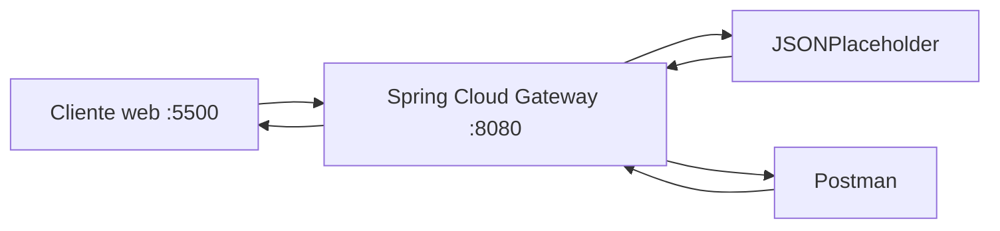
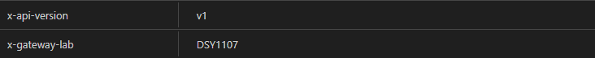
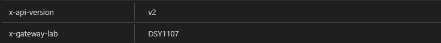
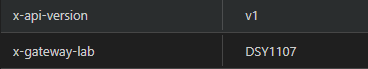

# Evidencias · Laboratorio API Gateway

## Integrantes
- Nombre: Deymon Gonzalez
- Nombre: Juan Tapia
- Nombre: Franco Garay
- Nombre: Fernando Camus

## 1. Backend directo

Antes de utilizar el gateway, registrar las pruebas directas contra JSONPlaceholder.

| Método | URL | Status | Observación |
|---|---|---:|---|
| GET | `https://jsonplaceholder.typicode.com/posts` | 200 OK | Devuelve un array con todos los posts disponibles |
| GET | `https://jsonplaceholder.typicode.com/posts/1` | 200 OK | Devuelve un unico objeto JSON que corresponde al ID 1  |

**¿Qué información del backend conoce el cliente en este escenario?**

Respuesta: El cliente conoce la estructura de los datos (userId, id, title y body). Ademas, puede ver el dominio del servidor (https://jsonplaceholder.typicode.com) y sus rutas (/posts y /posts/1)

---

## 2. Arquitectura final



Explicar brevemente qué responsabilidad cumple cada componente.

Cliente web :5500 - Actúa como la interfaz del usuario. Aquí se realizan peticiones para consumir servicios, por lo que no se conecta directamente a los servidores finales, sino que envíaaa las solicitudes al Gateway.

Spring Cloud Gateway :8080 - Es el intermediario y el único punto de entrada del sistema. La responsibilidad principal es interceptar las solicitudes que vienen del cliente y redirigirlas al backend que corresponda. Aquí también se centralizan las configuraciones y permisos como el CORS.

JSONPlaceholder - Actúa como uno de los servicios backend. Aquí se aloja la lógica de negocio, en este caso, una API REST de prueba con posts y usuarios. Recibe las peticiones que el Gateway le reenvía, las procesa y devuelve la información de vuelta al Gateway.

Postman - Esto nos permite auditar e inspeccionar si el Gateway está modificando, agregando o enviando correctamente los parámetros antes de llegar al destino.

---

## 3. Pruebas HTTP mediante gateway

| Método | URL | Status | Headers relevantes | Interpretación |
|---|---|---:|---|---|
| GET | `/api/v1/posts` | 200 OK | content-type application/json; charset=utf-8 | colección |
| GET | `/api/v1/posts/1` | 404 Not Found | content-type application/json; charset=utf-8 | recurso individual |
| POST | `/api/v1/posts` | 201 Created | content-type application/json; charset=utf-8 | creación simulada |
| PUT | `/api/v1/posts/1` | 200 OK | content-type application/json; charset=utf-8 | actualización simulada |
| DELETE | `/api/v1/posts/1` | 200 OK | content-type application/json; charset=utf-8 | eliminación simulada |

Para POST y PUT incluir también el body enviado.
# POST: 
{

  "title": "mi nuevo post",

  "body": "contenido de prueba para el laboratorio",

  "userId": 1

}

# PUT:
{

  "id": 1,

  "title": "post actualizado",

  "body": "este contenido fue modificado mediante PUT",

  "userId": 1

}

---

## 4. Routing

- URL solicitada por el cliente: /api/v1/posts/1  
- `id` de la route: posts-v1
- predicate que hizo match: Path=/api/v1/posts/**
- URI/integration configurada: https://jsonplaceholder.typicode.comc
- path recibido finalmente por el backend: /posts/1c
- función de `RewritePath`: Esta función captura todo lo que viene después del /api/v1/ y reescribe la ruta para que el backend reciba únicamente ese segmento final, ocultando el prefijo de la API al servidor destino

### Recorrido de una petición

Explicar con sus palabras:

```text
cliente → gateway → backend → gateway → cliente
```


cliente → gateway - El cliente manda una peticion HTTP al Gateway. 

gateway → backend - El Gateway intercepta esta petición, si todo esta bien, transforma la URL para reenviarla de forma oculta al servidor.

backend → gateway - El servidor procesa la solicitud, busca los datos que fueron pedidos y los devuelve de vuelta al Gateway

gateway → cliente - El Gateway toma la respuesta del backend y se la reenvía al cliente.
 
---

## 5. Versionado

- Evidencia `/api/v1`: 

| Header | Valor |
| :--- | :--- |
| x-api-version | v1 |
| x-gateway-lab | DSY1107 |

- Header `X-API-Version` observado: v1
- Evidencia `/api/v2`: 

| Header | Valor |
| :--- | :--- |
| x-api-version | v2 |
| x-gateway-lab | DSY1107 |

- Header `X-API-Version` observado: v2

Responder:

1. ¿Por qué mantener v1 y v2 simultáneamente? Se mantienen ambos v1 y v2 con el fin de evitar romper los sistemas en producción. Lo que también permite una transicion fluida mientras los clientes actualizan sus integraciones.
2. ¿Qué consumidores podrían seguir usando v1? Cualquier sistema o API externa que ya esté programada apuntando a la ruta original.
3. ¿Cuándo retirarían una versión? Se retira tras un peridodo de aviso y solo cuando los logs del Gateway demuestren que el trafico hacia la rruta v1 es inexistente.
4. ¿Versionar el contrato público es lo mismo que versionar el servidor desplegado? No. Versionar el servidor implica actualizar el codigo fuente o la infraestructura sin alterar las rutas. Versionar el contraro apúblico implica exponer una nueva ruta (v2 por ejemplo) porque la forma en que el cliente envia o recibe datos ha cambiado y rompe la compatibilida anterior.

---

## 6. Header transversal

- Header esperado: `X-Gateway-Lab: DSY1107`
- Evidencia observada:

| Header | Valor |
| :--- | :--- |
| x-gateway-lab | DSY1107 |

- ¿Por qué este comportamiento puede considerarse transversal?: Porque se configura a nivel de los filtros por defecto del Gateway. Esto hace que el header se inyecte autaomaticamente en todas las respuestas hacia el cliente, sin importar la ruta especifica consultada.

---

## 7. CORS

### Antes de configurar CORS

- URL del cliente web: `http://localhost:5500`
- Endpoint consultado: http://localhost:8080/api/v1/posts/1
- Resultado visible: Petición desde el navegador falló y arroja TypeError: Failed to fetch.
- Mensaje relevante en Console/Network: Access to fetch at http://localhost:8080/api/v1/posts/1 from origin http://localhost:5500 has been blocked by CORS policy: No SSS Access-Control-Allow-Origin header is present on the requested resource. (El Gateway rechaza la petición cruzada por defecto).

### Después de configurar CORS

- Resultado visible: La petición desde el navegador sigue fallando (TypeError: Failed to fetch).
- `Access-Control-Allow-Origin`: El navegador detecta valores múltiples (http://localhost:5500, http://localhost:5500) y bloquea la respuesta por seguridad.
- `Access-Control-Allow-Methods`: GET, POST, PUT, DELETE, OPTIONS (Según lo configurado en la rama feature/cors).

### Preflight OPTIONS

- Request utilizado: OPTIONS http://localhost:8080/api/v1/posts/1
- Status: 200 OK
- Headers relevantes: Access-Control-Allow-Origin, Access-Control-Allow-Methods

Responder:

1. ¿Por qué Postman puede funcionar cuando el navegador falla? Postman es una herramienta de pruebas que no implementa la politica del mismo origen. CORS es una restriccion de seguridad que solo existe y aplica dentro de los navegadores webs.
2. ¿Qué es un preflight? Es una peticion HTTP previaa que el navegador lanza automaticamente antes de una peticion compleja para preguntarle al serviddor is el origen actual tiene los permisos necesarios.
3. ¿CORS autentica o autoriza usuarios? No. CORS solo autoriza ORIGENES (URLs o dominios).
4. ¿Qué riesgo tendría permitir cualquier origen sin analizar el contexto? Dejar el origen abierto expone el backend a ataques donde sitios web no autorizados pueden consumir recursos de la API o ejecutar acciones sin de un cliente sin su consentimiento.

---

## 8. Richardson Maturity Model nivel 2

Explicar qué elementos observados en el laboratorio permiten afirmar que la API utiliza recursos, métodos HTTP y status codes con semántica HTTP.

En el laboratorio la API utiliza URLs que identifican entidades especificas como /posts para una coleccion y /posts/1 para uno individual. Ademas se utilizan los verbos de manera correcta, GET para leer, POST para crear, PUT para actualizar y DELETE para eliminar. Por ultimo la API ddevuelve codigos de estado HTTP éstandar para informar el resultado de la operación.s

---

## 9. Responsabilidades

| Responsabilidad | Cliente | Gateway | Backend | Justificación |
|---|:---:|:---:|:---:|---|
| routing | | X | | El routing es el encargado de recibir la petición y redirigirla al servicio correspondientea |
| lógica de negocio | | | X | Es el comportamiento central de la aplicación |
| autenticación/autorización | | X | | Es el único punto de entrada, aquí se centraliza la validación de identidad y permisos |
| transformación de rutas | | X | | Modifica la estructura de la URL mediante el RewritePath antes de que llegue al servidor |
| persistencia | | | X | Es el encargado de conectarse a la base de datos para almacenar, actualizar o eliminar la información |
| rate limiting | | X | | Protege al sistema limitando la cantidad de peticiones por segundo que puede hacer un cliente, para evitar sobrecargas en los servicioss |
| reglas de negocio | | | X | Aplica las validaciones y restricciones de la aplicación |
| observabilidad | | X | | Al interceptar todas las peticiones entrantes y salientes, este es el punto donde se rregistran alogs, metricas y se monitorea todo |

---

## 10. Problemas encontrados

1. Problema:
   - causa:
   - solución:

---

## 11. Colaboración GitHub

| Integrante | Rama | Pull Request | Aporte principal |
|---|---|---|---|
| Juan Tapia | feature/routing-v1 | https://github.com/Deymon2105/dsy1107-lab-api-gateway-grupo-12/pull/1 | Ejecución de las pruebas HTTP iniciales a través del Gatewa para comprobar el funcionamiento de la ruta v1 |
| Deymon Gonzalez | feature/version-v2 | https://github.com/Deymon2105/dsy1107-lab-api-gateway-grupo-12/pull/2 | Implementación de la nueva ruta v2 para el versionado de la API |
| Franco Garay | feature/cors | https://github.com/Deymon2105/dsy1107-lab-api-gateway-grupo-12/pull/3 | Configuración de CORS en el API Gateway para autorizar peticiones provenientes del cliente webs |
| Fernando Camus | docs/evidencias | https://github.com/Deymon2105/dsy1107-lab-api-gateway-grupo-12/pull/3 | Ejecución de pruebas HTTP, análisis y redacción del informe técnico de evidencias del laboratorio |

Agregar enlaces a los Pull Requests.

---

## 12. Conclusiones

- ¿Qué problema resolvió el gateway? El Gateway ocultó la URI real y la arquitectura del backend publico.
- ¿Qué concepto del laboratorio sería equivalente al trabajar posteriormente con Amazon API Gateway? La definicion de rutas y la integracion de URIs hacia backends mediante predicates, asi como la aplicacion centralizada de CORS.
- ¿Qué aprendió el grupo que no depende específicamente de Spring Cloud Gateway? El grupo aprendio el comportamiento de las politicas de seguridad de los navegadores (CORS, Preflight y demas), el uso correcto de los metodos HTTP (Modelo de Richardson) y ela flujo de colaboracion tecnica en GitHub mediante Pull Requests.